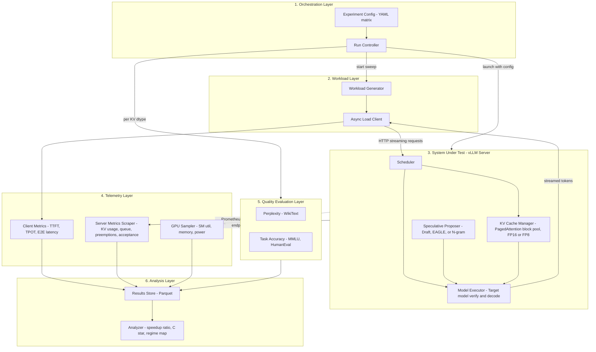
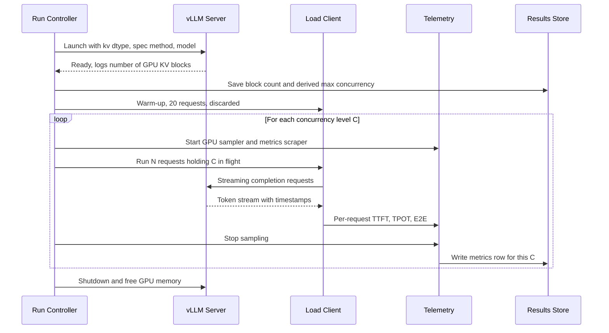
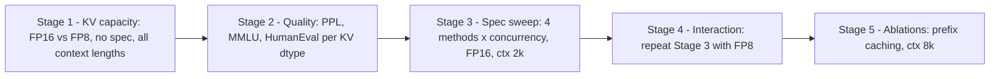

# Progress Report: Balancing Memory and Compute in LLM Serving

## A. Proposed Approach

**Proposed Solution**
This project looks at the conflict between two LLM serving optimizations: reduced-precision KV caching (FP8), which saves memory, and speculative decoding, which uses spare compute. We are building a controlled benchmarking harness that sweeps concurrency and context length across a matrix of KV-cache precisions and speculation methods. The main deliverable is the **crossover point $C^*$**: the concurrency level beyond which speculative decoding stops reducing latency and starts increasing it. We also want to show how $C^*$ shifts when the KV cache moves from FP16 to FP8.

**Underlying Methodology**
We measure the system directly instead of modelling it, and we change one factor at a time:
1. **Memory profiling (Topic 2):** Compare FP16 and FP8 KV caches on the same model and weights. Record (a) the KV block pool capacity and the concurrency it allows, (b) the throughput actually achieved as load rises, and (c) the quality cost (perplexity, MMLU, HumanEval).
2. **Compute profiling (Topic 3):** Run no-speculation, draft-model, EAGLE and n-gram speculation across the same concurrency sweep. Record TPOT, acceptance rate and GPU utilization.
3. **Synthesis:** For each KV precision, compute the speedup ratio $S(C) = \text{TPOT}_{\text{base}}(C) / \text{TPOT}_{\text{spec}}(C)$ and find $C^*$ where $S(C^*) = 1$. Plot this as a regime map.

**Justification**
vLLM and SGLang let you turn on FP8 KV caching and speculative decoding together. Published evaluations mostly test each one on its own, and speculative decoding is usually tested at low batch sizes. GPU memory and compute are both fixed. Raising batch size with PagedAttention and FP8 increases arithmetic intensity, and that uses up the idle compute speculation needs. A load-aware measurement of how the two interact fills that gap.

---

## B. System Design

### B.1 Architecture Overview

The harness has six layers. The serving engine is treated as the **System Under Test (SUT)**: we configure it and observe it, but we don't modify it. Everything around it is our code.

### B.2 Component Responsibilities

| # | Component | What it does | Code module |
|---|---|---|---|
| 1 | **Experiment Config** | Defines the factor matrix (KV dtype × speculation method × concurrency × context length) and the fixed controls (model, weight quantization, `max_model_len`, `gpu_memory_utilization`, seed). | `configs/experiments.yaml` *(planned)* |
| 1 | **Run Controller** | Handles each server's lifecycle: start vLLM with a config, wait for health, warm up, run the sweep, scrape metrics, shut down, free GPU memory. Records the startup KV block count. Retries or skips failed configs. | `orchestrator.py` *(planned, refactored from `run_benchmark.py`)* |
| 2 | **Workload Generator** | Builds request sets: **synthetic fixed-length** prompts (randomized token content so prefixes aren't shared) for controlled context sweeps, and **ShareGPT-sampled** prompts for realistic length distributions. | `workload.py` *(planned)* |
| 2 | **Async Load Client** | Keeps exactly *C* requests in flight (closed-loop) or sends them on a Poisson arrival schedule (open-loop). Streams responses so it can timestamp each token. | `load_client.py` *(planned)* |
| 3 | **Scheduler** *(vLLM)* | Admits requests while there are free KV blocks. Queues or preempts them when the pool is full. | — (SUT) |
| 3 | **KV Cache Manager** *(vLLM)* | PagedAttention block pool sized at startup. With `kv_cache_dtype=fp8`, each block holds 2× the tokens, which doubles capacity. | — (SUT); concepts reproduced in `paged_attention.py` ✅ |
| 3 | **Speculative Proposer** *(vLLM)* | Proposes *k* draft tokens per step (draft model, EAGLE head, or n-gram prompt lookup). The target model verifies all of them in one forward pass. | — (SUT) |
| 4 | **Client Metrics** | Per request: TTFT, TPOT (inter-token latency), end-to-end latency. Aggregated as p50/p90/p99. | `telemetry.py` *(planned)* |
| 4 | **Server Metrics Scraper** | Polls vLLM's `/metrics` endpoint for KV cache usage %, running/waiting request counts, preemption count, and speculative-decoding draft/accepted token counts. | `telemetry.py` *(planned)* |
| 4 | **GPU Sampler** | A background thread that samples SM utilization, memory used and power through NVML (`pynvml`) at 10 Hz. | `telemetry.py` *(planned)* |
| 5 | **Quality Evaluator** | Runs perplexity (WikiText-2) and task accuracy (MMLU, HumanEval through `lm-eval-harness`) once per KV dtype. Quality doesn't depend on load, so this runs outside the sweep. | `kv_cache.measure_perplexity` ✅, `quality_eval.py` *(planned)* |
| 6 | **Analyzer** | Joins all runs, computes throughput curves and $S(C)$, finds $C^*$ by interpolation, and draws the regime map. | `plotting.py` ✅ (extend into `analysis.py`) |

### B.3 Per-Run Workflow

### B.4 Experiment Matrix and Staging

Running every combination would mean 2 × 4 × 9 × 4 = 288 runs. We run it in stages instead:

| Factor | Levels |
|---|---|
| KV cache dtype | `auto` (FP16/BF16), `fp8` |
| Speculation | none, draft model, EAGLE, n-gram |
| Concurrency *C* | 1, 2, 4, 8, 16, 32, 64, 128, 256 |
| Context length | 512, 2048, 4096, 8192 |
| **Held fixed** | Target model (Llama-3-8B-Instruct), weight format, output length (256 tokens), `gpu_memory_utilization=0.9`, **prefix caching OFF** (except in the Stage 5 ablation), greedy decoding, seed |

### B.5 Inputs and Outputs

**Inputs**
- Target model weights and draft or EAGLE weights (where used)
- Experiment config (factor levels and fixed controls)
- Prompt datasets: synthetic random-token prompts, ShareGPT samples, WikiText-2, MMLU, HumanEval

**Outputs**

| Output | Answers |
|---|---|
| KV block count and max supported concurrency per (dtype, context length) | How much concurrency FP8 actually buys |
| Throughput (tokens/s) vs *C* curves, FP16 vs FP8 | Whether that concurrency turns into throughput or hits a compute ceiling |
| ΔPerplexity, ΔMMLU, ΔHumanEval (FP8 − FP16), per context length | The quality cost and where it shows up |
| TPOT p50/p99 vs *C* per speculation method, with acceptance rate and SM utilization | How speculation's benefit fades under load |
| $S(C)$ curves and $C^*$ per (method, KV dtype) | The crossover point |
| Regime map | When to prioritize memory and when to prioritize latency |

### B.6 How Concurrency Capacity Is Measured

vLLM reserves its KV pool when it starts, so it doesn't OOM as load grows. Instead it **queues or preempts** requests. We measure the ceiling in two ways that should agree:
1. **Analytically:** $C_{\max} = \dfrac{N_{\text{blocks}} \times B}{L_{\text{prompt}} + L_{\text{output}}}$, using the block count vLLM reports at startup ($B$ = 16 tokens per block).
2. **Empirically:** the lowest *C* at which the waiting-queue length or preemption count goes above zero.

The HuggingFace OOM-based sweep in `kv_cache.py` is still useful for local learning without PagedAttention.

---

## C. Technical Feasibility

**Tools, Frameworks, and Datasets**
- **Serving:** vLLM (OpenAI-compatible server, PagedAttention, `--kv-cache-dtype fp8`, speculative decoding through `speculative_config`)
- **Local prototyping:** PyTorch, HuggingFace `transformers`, Jupyter
- **Telemetry:** `aiohttp`/`httpx` (async client), `pynvml`, Prometheus text parsing
- **Quality:** `lm-eval-harness` (MMLU, HumanEval), WikiText-2 perplexity
- **Analysis:** pandas, matplotlib
- **Infrastructure:** Laptop or Colab for development; college GPU server (ideally Ada/Hopper, e.g. L40S/H100) for the final sweeps

**Feasibility**
Every component above the SUT is ordinary Python, and vLLM already provides the serving features. The main risk is hardware rather than software.

**Challenges, Assumptions, and Limitations**
1. **FP8 hardware support:** Native FP8 needs Ada or Hopper GPUs. On an A100, vLLM still stores the cache in FP8, so the capacity gain is measurable, but there's no FP8 compute speedup. We'll report which case applies.
2. **vLLM API drift:** Speculative decoding options have changed between vLLM releases. We'll pin one vLLM version for the whole project.
3. **EAGLE availability:** An EAGLE head has to exist for the chosen target model. That's one reason we picked Llama-3-8B-Instruct.
4. **Measurement noise:** We'll do warm-up runs, use 3 repetitions per point, and report medians with spread.
5. **Assumption:** Greedy decoding and synthetic prompts approximate production traffic. The ShareGPT runs partly check this.
6. **Limitation:** Single-GPU only. Tensor parallelism is out of scope.

---

## D. Implementation Plan

**Completed Work**
- `kv_cache.py`: KV cache extraction, memory profiling, INT8 simulation, per-layer quantization error, perplexity, HF-based latency and batch sweeps
- `paged_attention.py`: Educational PagedAttention simulator with block tables, on-demand allocation, reference-counted block sharing and copy-on-write
- `plotting.py`: Cache size vs context, throughput vs concurrency, quantization error charts
- `run_benchmark.py`: First vLLM offline benchmark (to be refactored into the orchestrator)
- Notebooks `01` and `02`: Local experiments with GPT-2. Baseline perplexity measured: 112.15

**Ongoing Work**
- Refactoring `run_benchmark.py` into a server-based Run Controller
- Removing the identical-prompt and prefix-caching problem from the benchmark

**Pending Tasks**

| Task | Core functionality | Outcome |
|---|---|---|
| T1 | `workload.py` + `load_client.py` | Controlled concurrency with per-token timestamps |
| T2 | `telemetry.py` | Unified client, server and GPU metrics per run |
| T3 | `orchestrator.py` + `experiments.yaml` | Unattended execution of the staged matrix |
| T4 | `quality_eval.py` | Quality deltas between FP16 and FP8 |
| T5 | `analysis.py` | Throughput curves, $S(C)$, $C^*$, regime map |
| T6 | Server runs, Stages 1–5 | Final dataset and figures for the report |

**Next Steps**
1. Build T1–T3 and validate them end-to-end on Colab with TinyLlama and n-gram speculation (n-gram needs no extra weights).
2. Get the GPU server, pin the vLLM version, and run Stages 1–2.
3. Run Stages 3–4, compute $C^*$, and produce the regime map.
4. Review results with the mentor and run the Stage 5 ablations.
