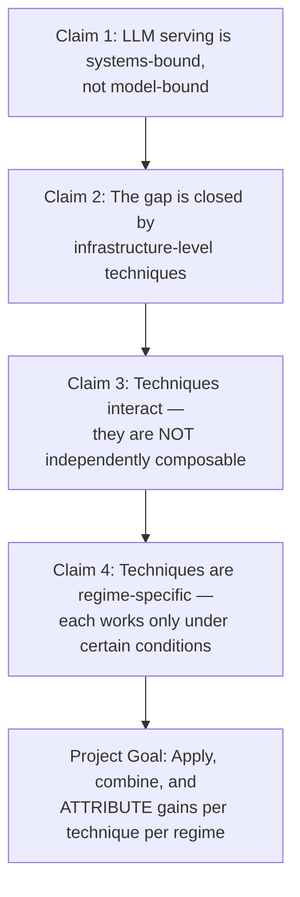
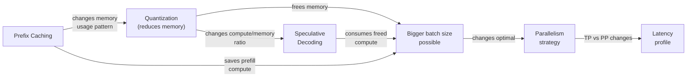
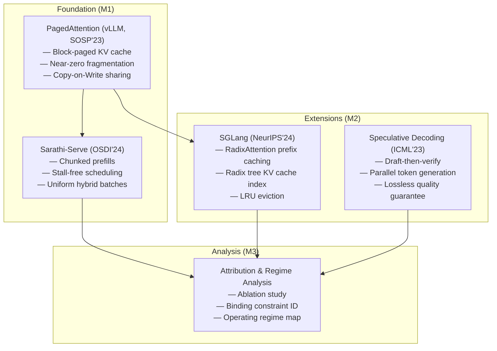

# Deep Analysis: Efficient LLM Serving — Project Statement Breakdown

## 1. The Central Thesis (What the Project Believes)

The project statement makes **four layered claims** that form a logical chain:



### Claim 1 — Serving Is Systems-Bound

LLM inference has two phases, and each is dominated by a different hardware constraint:

| Phase | What Happens | Binding Constraint | Why |
|-------|-------------|-------------------|-----|
| **Prefill** (prompt processing) | All input tokens processed in parallel via matrix multiplication | **Compute (FLOPS)** | Large GEMM operations saturate the GPU's ALUs |
| **Decode** (token generation) | One token generated at a time; must read all model weights + KV cache per token | **Memory bandwidth** | Each decode step reads ~GBs of data but performs very little arithmetic per byte read |

The key insight: during decode, the GPU's compute units are *massively underutilized*. The **arithmetic intensity** (FLOPs per byte) of a single-token decode is far below what the hardware is designed for. The GPU sits idle waiting for data to arrive from HBM.

> **Implication for the project:** Any optimization must be understood in terms of *which bottleneck it relieves*. An optimization that saves compute does nothing during decode (which is bandwidth-bound). An optimization that saves memory allows more requests to be batched, which *raises* arithmetic intensity and pushes toward better hardware utilization.

### Claim 2 — Infrastructure Techniques Close the Gap

The project identifies **four categories** of infrastructure-level optimization:

| Category | Concrete Techniques | What It Addresses | Reference Paper |
|----------|-------------------|-------------------|----------------|
| **Reduced-precision weights & KV cache** | FP16 → INT8/INT4 weights (GPTQ, AWQ); FP16 → FP8/INT8 KV cache | Reduces memory footprint → more concurrent requests → higher batch size → better GPU utilization | General quantization literature |
| **Reuse of previously computed context** | Prefix caching via RadixAttention (radix-tree-based KV cache sharing) | Avoids redundant prefill computation for shared prefixes across requests | **SGLang (NeurIPS 2024)** |
| **Informed parallelism strategy** | Tensor Parallelism (TP) vs. Pipeline Parallelism (PP) vs. replication; chunked prefills for stall-free scheduling | Determines how model shards across GPUs and how prefill/decode are interleaved | **Sarathi-Serve (OSDI 2024)** |
| **Multi-token generation per pass** | Speculative decoding (draft-then-verify) | Converts idle compute into useful work by verifying multiple draft tokens in one forward pass | **Leviathan et al. (ICML 2023)** |

And the foundational memory management technique underlying all of them:

| Foundation | Technique | What It Addresses | Reference Paper |
|-----------|-----------|-------------------|----------------|
| **Efficient KV cache memory** | PagedAttention (block-based paging with virtual-to-physical mapping, CoW) | Eliminates internal/external fragmentation → near-zero KV cache waste → higher batch sizes | **vLLM (SOSP 2023)** |

### Claim 3 — Techniques Interact (Non-Composability)

This is the most critical and nuanced claim. The project states that applying these techniques independently can yield **no net improvement** because they have hidden dependencies:



**Concrete interaction examples the project expects you to discover:**

1. **Quantization × Concurrency × Parallelism:**
   - INT4 weights free ~50% of weight memory → more KV cache space → supports more concurrent requests → batch size increases → the model becomes more compute-bound → tensor parallelism (which scales compute) becomes more valuable than pipeline parallelism (which scales memory)
   - Without quantization, the same model might be memory-bound, making PP the right choice

2. **Speculative Decoding × Load Level:**
   - At **low load** (few concurrent requests): decode is heavily bandwidth-bound, GPU compute is idle → speculative decoding uses that idle compute for free → significant latency win
   - At **high load** (many concurrent requests): batching already raises arithmetic intensity → GPU compute is now *useful* → speculative decoding *competes* for the same compute with real decode work → overhead of draft model may exceed gains → net negative
   - **The project explicitly asks you to find the crossover point**

3. **Prefix Caching × Workload Structure:**
   - If requests share long common prefixes (e.g., system prompts, few-shot examples): massive savings in prefill computation and memory
   - If requests have unique prompts: prefix caching adds overhead (radix tree lookups, cache management) with zero benefit

### Claim 4 — Regime-Specific Effectiveness

Every technique has a "where it works" and a "where it doesn't." The project demands you map each technique to its effective regime:

| Technique | Works Well When | Doesn't Help When |
|-----------|----------------|-------------------|
| Weight quantization (INT4/INT8) | Memory is the bottleneck; need more concurrent requests; latency target is loose enough to tolerate small quality loss | Already compute-bound; quality degradation is unacceptable |
| KV cache quantization (FP8/INT8) | Long contexts where KV cache dominates memory; many concurrent requests | Short contexts where KV cache is small relative to weight memory |
| Prefix caching | High prefix overlap across requests (chatbots with system prompts, few-shot, agents with tool definitions) | Unique prompts; cache eviction rate too high |
| Chunked prefill | Mixed prefill+decode batches; pipeline parallelism deployments; long prompts that would stall decode | Very short prompts where prefill is already fast |
| Speculative decoding | Low to moderate concurrency; decode-bound regime; high acceptance rate from draft model | High concurrency (compute contention); poor draft model quality; very long contexts (large KV cache overhead for draft) |
| Tensor parallelism | Compute-bound regime; need to reduce per-request latency | Few GPUs; communication overhead dominates |
| Pipeline parallelism | Memory-bound regime; many GPUs; throughput-priority | Latency-sensitive; pipeline bubble overhead |

---

## 2. What Each Milestone Actually Asks For

### M1: Optimized Single-Instance Serving

**In plain terms:** Take a model off the shelf, deploy it naively, then make it significantly faster *without changing the model architecture or adding workload-aware tricks*.

````carousel
### M1 — What to Do
1. **Choose a model**: Open-weight (e.g., Llama-3-8B, Mistral-7B, or larger)
2. **Establish a baseline**: Deploy with default settings (FP16 weights, FP16 KV cache, default batching, no parallelism tricks)
3. **Measure baseline metrics** at a stated latency target:
   - Time To First Token (TTFT)
   - Time Per Output Token (TPOT) / Inter-Token Latency (ITL)
   - End-to-end latency (p50, p95, p99)
   - Throughput (tokens/sec, requests/sec)
4. **Apply optimizations one at a time**, measuring the delta:
   - Weight quantization (INT8, INT4 via GPTQ/AWQ)
   - KV cache quantization (FP8, INT8)
   - Tuned batching (continuous batching, max batch size tuning)
   - Prefill scheduling (chunked prefills à la Sarathi-Serve)
   - Parallelism strategy (TP, PP, or hybrid if multi-GPU)
5. **Verify output quality is preserved**: Run an evaluation benchmark (e.g., MMLU, HumanEval, or perplexity on a held-out set) before and after quantization
<!-- slide -->
### M1 — What to Deliver
- **Quantitative improvement** over baseline at the stated latency target
- **Quality verification**: evidence that output quality is not degraded (or degradation is characterized)
- **Understanding** of which M1 optimization contributed what (this is prep for M3)
````

> [!IMPORTANT]
> M1 is about **memory and scheduling optimizations only** — no workload-specific tricks (prefix caching) and no multi-token generation (speculative decoding). Those are M2.

### M2: Context Reuse and Multi-Token Generation

**In plain terms:** Now exploit the *structure of the workload* and the *idle compute* to extract more performance.

````carousel
### M2 — Context Reuse (Prefix Caching)
**What:** Implement RadixAttention-style prefix caching so that requests sharing common prompt prefixes reuse the same KV cache entries instead of recomputing them.
**Why it helps:**
- Reduces TTFT by skipping prefill for shared tokens
- Reduces total GPU memory usage (shared KV cache entries)
- Reduces total compute (fewer FLOPs for prefill)
**What to measure:**
- TTFT reduction as a function of prefix overlap ratio (0%, 25%, 50%, 75%, 100% shared prefix)
- Throughput improvement under varying prefix-sharing workloads
- Cache hit rate and eviction behavior
<!-- slide -->
### M2 — Multi-Token Generation (Speculative Decoding)
**What:** Add a draft model that proposes multiple tokens, verified by the target model in a single forward pass.
**Why it helps:**
- During decode, the GPU has idle compute → draft model runs "for free"
- If the draft model has a high acceptance rate, you generate K tokens in ~1 forward pass instead of K forward passes
**What to measure:**
- Acceptance rate (what fraction of draft tokens are accepted)
- Latency improvement vs. baseline and vs. M1 at various concurrency levels
- **The crossover load**: at what request concurrency does speculative decoding stop helping (or start hurting)?
- Throughput under low, medium, and high load
<!-- slide -->
### M2 — Key Deliverable
**Determine the conditions under which each technique contributes:**
- Prefix caching: What minimum prefix overlap is needed for it to help? How does cache size affect it?
- Speculative decoding: At what load level does it stop being beneficial? What acceptance rate is needed for a net win?
- These are not just "does it help?" but "when and why does it help, and when does it stop?"
````

> [!IMPORTANT]
> M2 builds *on top of* M1's optimized deployment. You're adding these techniques to the already-quantized, already-well-scheduled model.

### M3: Attribution and Operating-Regime Analysis

**In plain terms:** You now have a stack of techniques from M1 and M2. M3 asks you to disentangle their contributions and map the entire operating-regime landscape.

This is the **most intellectually demanding milestone** because it requires:

````carousel
### M3 — Attribution Analysis
**Question:** "How much did each technique contribute to the total gain?"
**Challenge:** Techniques interact, so you cannot simply sum individual gains.
**Method:** Ablation study — systematically enable/disable each technique and measure the delta:
```
Full Stack = Quantization + KV quant + Chunked Prefill + Prefix Caching + Speculative Decoding
```
Run experiments with each technique removed one at a time to measure its marginal contribution *in the presence of the others*. Also run with techniques added one at a time to the baseline to measure standalone contribution.
The difference between "standalone contribution" and "marginal contribution in the full stack" reveals **interactions**.
<!-- slide -->
### M3 — Binding Constraint Identification
**Question:** "In the final optimized configuration, what is the bottleneck?"
After applying all optimizations, the system is still bounded by *something*:
- Is it now compute-bound (all memory optimizations have shifted the bottleneck to FLOPs)?
- Is it now communication-bound (inter-GPU bandwidth limits scaling)?
- Is it now scheduling-bound (prefill chunks are too large / too small)?
- Is it now quality-bound (further quantization would degrade output)?
Identifying this tells you where the *next* improvement would come from.
<!-- slide -->
### M3 — Operating Regime Map
**Question:** "Under what conditions is our configuration the right one?"
Vary three dimensions and measure performance:
1. **Context length**: Short (256), Medium (2K), Long (8K+)
2. **Concurrency**: Low (1-4 requests), Medium (16-32), High (64+)
3. **Prefix-reuse structure**: None, Moderate (50% shared), Heavy (90%+ shared)
For each combination, report which techniques are helping, which are neutral, and which are hurting.
**A technique found to give NO benefit in a regime, with an explanation of WHY, is explicitly stated to be a valid deliverable.**
````

> [!CAUTION]
> M3 is NOT asking you to always show improvement. It is asking you to produce a **rigorous characterization** — including negative results. Showing that speculative decoding hurts at high concurrency, with a clear explanation of *why* (compute contention), is exactly what M3 wants.

---

## 3. How the Four Papers Map to the Project



### Paper → Technique → Milestone Mapping

| Paper | Key Technique You Use | In Milestone | Role in the Project |
|-------|----------------------|--------------|---------------------|
| **PagedAttention (vLLM)** | Block-paged KV cache management | M1 | **Foundation** — enables all other optimizations by eliminating memory waste. Without efficient KV cache management, you can't fit enough requests to benefit from batching, and prefix caching can't share memory blocks. |
| **Sarathi-Serve** | Chunked prefills + stall-free scheduling | M1 | **Scheduling** — prevents long prefills from blocking decode tokens. Creates uniform-compute hybrid batches. Critical for pipeline parallelism efficiency. |
| **SGLang** | RadixAttention prefix caching | M2 | **Context reuse** — exploits workload structure (shared prefixes) to avoid redundant computation. Only valuable when workload has prefix overlap. |
| **Speculative Decoding** | Draft-then-verify multi-token generation | M2 | **Compute utilization** — converts idle compute during decode into useful token generation. Only valuable at low-to-moderate concurrency. |

---

## 4. The Evaluation Framework You Need

### Metrics to Track

| Metric | What It Measures | When It Matters |
|--------|-----------------|-----------------|
| **TTFT** (Time to First Token) | Prefill latency | User-facing latency; affected by prefix caching and chunked prefill |
| **TPOT** (Time Per Output Token) | Decode latency per token | Per-token responsiveness; affected by speculative decoding and batching |
| **ITL** (Inter-Token Latency) | Time between consecutive tokens | Streaming experience quality; variance matters |
| **End-to-end latency** (p50/p95/p99) | Total request latency | SLA compliance; tail latency is critical |
| **Throughput** (tokens/sec) | Total generation rate | System efficiency; affected by batch size and parallelism |
| **Goodput** (useful tokens/sec) | Throughput minus wasted work | Critical for speculative decoding (rejected draft tokens are wasted) |
| **GPU utilization** | Fraction of compute used | Indicates whether you're compute or memory bound |
| **KV cache utilization** | Fraction of allocated KV cache used | Indicates memory efficiency; affected by PagedAttention |

### Experimental Dimensions

| Dimension | Values to Test | Why |
|-----------|---------------|-----|
| **Concurrency** | 1, 2, 4, 8, 16, 32, 64 concurrent requests | Determines compute vs. memory boundedness |
| **Context length** | 256, 512, 1024, 2048, 4096, 8192 tokens | KV cache scales linearly; changes memory pressure |
| **Prefix overlap** | 0%, 25%, 50%, 75%, 100% | Determines prefix caching effectiveness |
| **Output length** | Short (32), Medium (256), Long (1024) | Determines decode vs. prefill dominance |
| **Quantization level** | FP16, INT8, INT4 (weights); FP16, FP8, INT8 (KV cache) | Memory-quality tradeoff |

---

## 5. What "Success" Looks Like

> [!TIP]
> The project does NOT define success as "maximum throughput." It defines success as **understanding + measurable improvement + regime characterization.**

### Strong M1 Deliverable
- Baseline measurements with clear methodology
- Each optimization (quantization, KV quant, batching, chunked prefill, parallelism) measured individually
- A clear "best M1 configuration" with measured improvement (e.g., "2.3× throughput at p99 latency ≤ 500ms, with <1% MMLU degradation under INT4 weights + FP8 KV cache")

### Strong M2 Deliverable
- Prefix caching: measured TTFT reduction as function of prefix overlap (plot)
- Speculative decoding: measured latency improvement as function of concurrency, with **the identified crossover point** (plot showing where the curve crosses zero improvement)
- Clear statement of conditions: "prefix caching helps when overlap > X%; speculative decoding helps when concurrency < Y"

### Strong M3 Deliverable
- **Attribution table**: technique A alone gives +X%, technique B alone gives +Y%, A+B together gives +Z% (where Z ≠ X+Y, demonstrating interaction)
- **Binding constraint**: "the final configuration is compute-bound at high concurrency and memory-bound at low concurrency"
- **Regime map**: a matrix/heatmap showing which configuration is optimal for each (context length × concurrency × prefix overlap) cell
- **Negative results with explanations**: "speculative decoding provides no benefit at concurrency > 32 because the batch size already saturates GPU compute, and the draft model's overhead exceeds the gain from avoided serial steps"

---

## 6. Common Pitfalls to Avoid

> [!WARNING]
> - **Don't optimize without measuring the baseline first.** Every claim needs a before/after comparison.
> - **Don't assume techniques compose additively.** If quantization gives 2× and prefix caching gives 1.5×, the combination is NOT necessarily 3×.
> - **Don't use a single workload for all experiments.** The project explicitly asks for regime analysis across different workloads.
> - **Don't ignore quality.** Quantization can degrade output quality; this must be measured and reported.
> - **Don't dismiss negative results.** "Speculative decoding hurts at high load" is a *finding*, not a failure.

---

## 7. Summary: The Ask in One Paragraph

You are asked to **deploy an open-weight LLM, systematically apply infrastructure-level optimizations (quantization, efficient KV cache management, batched scheduling, prefix caching, speculative decoding, and parallelism), measure the gain from each, show that they interact non-additively, identify the operating regimes where each is and isn't effective, and determine what the binding constraint is in the final configuration** — producing not just a faster system but a rigorous characterization of *why* it is faster and *when* it would stop being faster.
