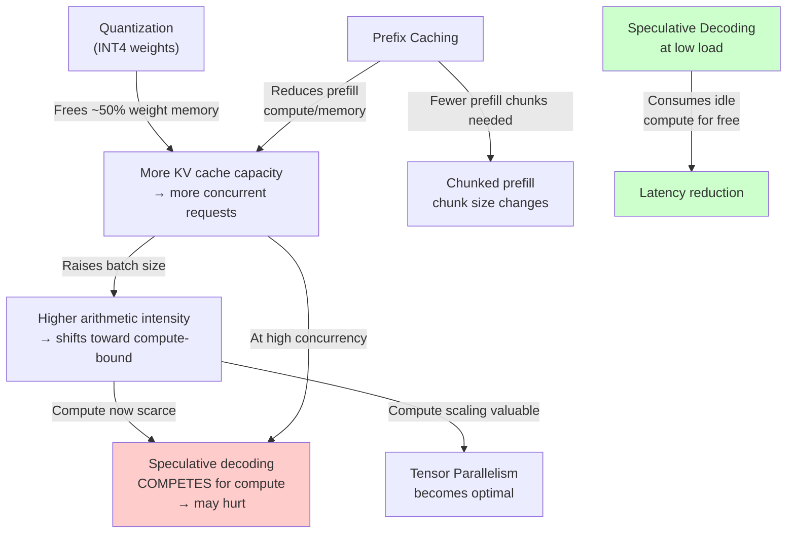

# Efficient LLM Serving: Project Report

> **Structured to address the 5 TA Learning Outcomes**

---

## 1. Background and Motivation

### 1.1 The Rise of Served Language Models

Large Language Models (LLMs) based on the Transformer architecture — GPT, Llama, Mistral, and their descendants — have moved from research artifacts to production infrastructure. Applications ranging from conversational agents and code assistants to document summarization and agentic workflows depend on hosted model endpoints that must serve thousands of concurrent users with low latency.

However, serving an LLM is fundamentally different from training one. During training, the objective is to maximize total throughput (tokens processed per second) over a fixed dataset; latency per sample is irrelevant. During serving, every user request has a latency deadline, and the system must simultaneously maximize throughput (to serve more users) and minimize latency (to meet quality-of-experience targets). This dual objective, combined with the unique computational structure of autoregressive generation, makes LLM serving a **systems optimization problem** rather than a model quality problem.

### 1.2 Anatomy of LLM Inference: Prefill and Decode

Autoregressive LLM inference proceeds in two distinct phases:

| Phase | Operation | Arithmetic Intensity | Hardware Bottleneck |
|-------|-----------|---------------------|---------------------|
| **Prefill** | Process the entire input prompt in parallel via large matrix-matrix multiplications (GEMMs) | **High** — many FLOPs per byte moved | **Compute (FLOPS)** — GPU ALUs are saturated |
| **Decode** | Generate one token at a time; each step requires reading all model weights and the accumulated KV cache | **Low** — very few FLOPs per byte moved | **Memory Bandwidth** — GPU ALUs idle, waiting for data from HBM |

This asymmetry is the root cause of inefficiency. During decode, a modern GPU like the NVIDIA A100 (with 312 TFLOPS of FP16 compute but only 2 TB/s of HBM bandwidth) operates at a tiny fraction of its peak compute capability because the bottleneck is the rate at which data can be fetched from memory.

### 1.3 The Roofline Model Perspective

The Roofline Model provides a quantitative framework for understanding this bottleneck. It plots achievable performance (FLOPS) against **arithmetic intensity** (FLOPs per byte of memory traffic):

- **Below the ridge point** (low arithmetic intensity): the workload is **memory-bandwidth-bound**. Performance scales with bandwidth, not compute.
- **Above the ridge point** (high arithmetic intensity): the workload is **compute-bound**. Performance scales with FLOPS.

A single-request decode step for a 7B-parameter model at FP16 has an arithmetic intensity of approximately **1 FLOP/byte** (each weight is read once, multiplied once, and accumulated). The ridge point of an A100 is approximately **156 FLOPs/byte** (312 TFLOPS ÷ 2 TB/s). This means a single decode step uses **less than 1%** of the GPU's compute capability — the remaining 99% is wasted, waiting for memory reads.

### 1.4 The KV Cache: The Other Memory Problem

Beyond model weights, each active request maintains a **Key-Value (KV) cache** — the accumulated attention keys and values from all previously generated tokens. This cache:

- **Grows linearly** with sequence length (context length)
- **Must be stored in GPU memory** for fast access during each decode step
- **Competes with model weights** for limited HBM capacity

For a 7B-parameter model at FP16 with a 4096-token context, the KV cache per request is approximately **1 GB**. On an 80 GB A100, after loading model weights (~14 GB at FP16), only ~66 GB remain for KV cache, limiting concurrent requests to roughly 66. In practice, naive memory management (pre-allocating maximum-length contiguous buffers) causes **60–80% memory waste** through internal and external fragmentation, reducing the effective concurrent capacity dramatically.

### 1.5 The Core Motivation

The gap between hardware capability and achieved utilization during serving is enormous. The project is motivated by the observation that this gap is closed not by improving the model itself, but by **infrastructure-level systems techniques** — reducing precision to move less data, reusing computation across requests, scheduling work to avoid stalls, and generating multiple tokens per forward pass to exploit idle compute. However, these techniques interact in complex ways and are effective only in specific operating regimes, making their principled combination an open problem.

---

## 2. Problem Statement

### 2.1 Problem Definition

**Goal:** Substantially improve the latency and throughput of a served open-weight LLM by applying and combining infrastructure-level optimizations, and establish which of them contribute the gains, under which operating conditions, and where they cease to be effective.

This is a **systems optimization and characterization** problem: the deliverable is not merely a faster deployment, but a rigorous understanding of *why* each technique helps, *when* it stops helping, and *how* multiple techniques interact.

### 2.2 Problem Scope

The project addresses optimizations at the **infrastructure and serving-system level**, explicitly excluding:

| In Scope | Out of Scope |
|----------|-------------|
| Weight quantization (INT8, INT4 via GPTQ/AWQ) | Model architecture changes (pruning, distillation, MoE conversion) |
| KV cache quantization (FP8, INT8) | Training or fine-tuning modifications |
| Batching and prefill scheduling strategies | Novel attention mechanisms (e.g., linear attention) |
| Parallelism strategy (TP, PP, replication) | Hardware-level modifications (custom kernels, FPGAs) |
| Prefix caching across requests | Application-level prompt engineering |
| Speculative decoding (draft-then-verify) | Multi-model orchestration (routing, cascading) |

### 2.3 Key Challenges

#### Challenge 1: Non-Composability of Optimizations
Techniques do not compose independently. Their gains interact in non-obvious ways:

```
Example interaction chain:
INT4 quantization → frees ~50% weight memory
    → more KV cache capacity → more concurrent requests
        → higher batch size → higher arithmetic intensity
            → GPU shifts from memory-bound to compute-bound
                → Tensor Parallelism (which scales compute) becomes more valuable
                → Speculative Decoding (which uses idle compute) becomes less valuable
```

Applying quantization changes the optimal parallelism strategy. Adding speculative decoding to a system that quantization has made compute-bound can yield **net negative** performance. These interactions mean that the optimal combination cannot be determined by measuring each technique in isolation and summing the gains.

#### Challenge 2: Regime-Specific Effectiveness
Every optimization has a "sweet spot" defined by operating conditions:

| Technique | Effective When | Ineffective/Harmful When |
|-----------|---------------|-------------------------|
| Weight quantization | Memory-bound; latency target tolerates minor quality loss | Already compute-bound; quality-critical applications |
| KV cache quantization | Long contexts; many concurrent requests | Short contexts (KV cache is a small fraction of memory) |
| Prefix caching | High prefix overlap across requests | Unique prompts; high cache eviction rate |
| Chunked prefill | Long prompts that stall decode; pipeline-parallel deployments | Very short prompts where prefill is already fast |
| Speculative decoding | Low-to-moderate concurrency (idle compute available) | High concurrency (compute already saturated); poor draft model accuracy |

A configuration that is optimal for a chatbot with long system prompts at moderate load may be suboptimal or harmful for a code completion service with unique short prompts at high load.

#### Challenge 3: Measurement and Attribution
When multiple techniques are applied simultaneously, attributing the observed improvement to individual techniques requires careful experimental design (ablation studies) and understanding of interaction effects (superadditive or subadditive contributions).

### 2.4 Assumptions

1. **Open-weight model:** The model's weights are publicly available and can be freely modified (quantized, sharded). Examples: Llama-3-8B, Mistral-7B, or larger.
2. **GPU hardware:** Deployment on NVIDIA GPUs (A100 or H100 class) with known memory capacity and bandwidth specifications.
3. **Serving framework:** Use of an established serving framework (vLLM, SGLang, or equivalent) as the deployment substrate.
4. **Workload characterization:** Synthetic but representative workloads with controlled parameters (context length, output length, prefix overlap, concurrency).
5. **Quality verification:** Output quality is assessed through standard benchmarks (e.g., MMLU, perplexity) rather than human evaluation.

### 2.5 Expected Outcomes (Per Milestone)

| Milestone | Expected Outcome |
|-----------|-----------------|
| **M1** | Measured improvement over baseline deployment at a stated latency target (e.g., "2× throughput at p99 ≤ 500ms"), with verified output quality preservation. Understanding of individual technique contributions. |
| **M2** | Characterization of when prefix caching and speculative decoding help: minimum prefix overlap for caching benefit; concurrency crossover point beyond which speculative decoding is harmful. |
| **M3** | Attribution table showing individual and combined technique contributions; identification of the binding constraint in the final configuration; operating-regime map showing which configuration is optimal for each (context length × concurrency × prefix overlap) cell. Negative results with explanations are a valid and expected part of this outcome. |

---

## 3. Existing Project Landscape

### 3.1 Current LLM Serving Frameworks

| Framework | Origin | Key Innovation | Strengths | Limitations |
|-----------|--------|---------------|-----------|-------------|
| **vLLM** | UC Berkeley (SOSP 2023) | PagedAttention — paged KV cache management eliminating fragmentation | Broadest model/hardware support; easy deployment (pip install, OpenAI-compatible API); de facto industry standard | RadixAttention-level prefix caching not native; historically less optimized for agentic/structured workloads |
| **SGLang** | UC Berkeley / LMSYS (NeurIPS 2024) | RadixAttention — radix-tree-based KV cache for automatic prefix sharing | Up to 6.4× throughput for prefix-heavy workloads; structured output acceleration via compressed FSMs | Narrower hardware support; benefit depends on workload having prefix overlap |
| **TensorRT-LLM** | NVIDIA | Compilation-based engine with fused kernels, FP8 native support | Highest raw throughput on NVIDIA hardware; deep kernel optimization | NVIDIA-only; requires recompilation per model/hardware; operational complexity |
| **TGI** | Hugging Face | Early adoption of continuous batching | Deep Hugging Face ecosystem integration | Slower iteration; narrower hardware support; increasingly a legacy option |
| **Orca** | Seoul National University (OSDI 2022) | Iteration-level scheduling (continuous batching) + selective batching | Foundational — up to 36.9× throughput over static batching | Research system; concepts absorbed into vLLM and SGLang |

### 3.2 Quantization Tools and Approaches

| Tool/Method | Type | Bit-Width | Mechanism | Quality Impact |
|-------------|------|-----------|-----------|---------------|
| **AWQ** | Weight quantization | 4-bit | Protects salient ~1% of weight channels via activation-aware scaling | Minimal; generally superior to GPTQ at 4-bit |
| **GPTQ** | Weight quantization | 2/3/4-bit | Second-order Hessian-based error redistribution | Good; broader bit-width flexibility |
| **FP8 (E4M3)** | Weight/KV cache | 8-bit floating point | Native hardware support on Hopper/Blackwell | Near-zero loss; preserves dynamic range |
| **INT8** | Weight/KV cache | 8-bit integer | Universal tensor-core support | Very low loss; works on A100 and earlier |
| **KVQuant** | KV cache | 3-4 bit | Per-channel scaling, outlier handling | Experimental; targets ultra-long contexts (1M+ tokens) |

### 3.3 Scheduling and Batching Strategies

| Strategy | How It Works | When It Helps |
|----------|-------------|---------------|
| **Static Batching** | Fixed batch processed as a unit; all requests wait for the longest | Simple but extremely wasteful; baseline only |
| **Continuous Batching (Orca)** | Iteration-level scheduling; requests enter/exit after each forward pass | Fundamental improvement; now standard |
| **Chunked Prefill (Sarathi-Serve)** | Split long prefills into fixed-size chunks; interleave with decode tokens | Prevents prefill stalls; enables pipeline parallelism efficiency |

### 3.4 Parallelism Strategies

| Strategy | What It Splits | When to Use | Trade-off |
|----------|---------------|-------------|-----------|
| **Tensor Parallelism (TP)** | Each layer's weights split across GPUs; each GPU computes part of every layer | Latency-sensitive; compute-bound after quantization; few GPUs (2–8) | Requires high-bandwidth interconnect (NVLink); communication at every layer |
| **Pipeline Parallelism (PP)** | Different layers on different GPUs; micro-batching through stages | Memory-bound; many GPUs; throughput-priority | Pipeline bubbles reduce efficiency; chunked prefill mitigates this |
| **Replication** | Full model copy on each GPU; requests load-balanced | Each instance fits on a single GPU; high concurrency | No latency benefit per request; linear throughput scaling |

### 3.5 Gaps in the Current Landscape

Despite the richness of available tools and techniques, several gaps remain:

> [!IMPORTANT]
> **Gap 1: No Unified Interaction Analysis.**
> Each paper and system evaluates its technique in isolation or against a baseline without the other techniques. No existing work systematically studies how quantization, prefix caching, chunked prefill, and speculative decoding interact when applied simultaneously.

> [!IMPORTANT]
> **Gap 2: No Operating-Regime Map.**
> No existing work provides a comprehensive characterization of which technique (or combination) is optimal across the full space of (context length × concurrency × prefix overlap × quantization level).

> [!IMPORTANT]
> **Gap 3: Speculative Decoding Crossover Not Quantified in Practice.**
> While the theoretical argument that speculative decoding hurts at high concurrency is well-known, the empirical crossover point — the exact load level and batch size at which it transitions from helpful to harmful — has not been precisely characterized in a combined-optimization setting.

> [!IMPORTANT]
> **Gap 4: Binding Constraint Shift Not Tracked.**
> Applying one optimization (e.g., quantization) shifts the binding constraint from memory to compute, which changes the effectiveness of every other optimization. No existing work tracks this "constraint migration" across an optimization stack.

---

## 4. Related Work

### 4.1 Core Reference Papers

#### 4.1.1 PagedAttention — Efficient Memory Management for LLM Serving (vLLM)
**[Kwon et al., SOSP 2023]**

**Core Idea:** Borrows the concept of virtual memory paging from operating systems and applies it to KV cache management. Instead of pre-allocating contiguous memory for each request's maximum possible length, KV cache is stored in fixed-size **blocks** that need not be physically contiguous.

**Mechanism:**
- KV cache is divided into fixed-size blocks (e.g., 16 tokens per block)
- A **block table** maps logical token positions to physical memory blocks (analogous to an OS page table)
- Memory is allocated **on demand** as tokens are generated
- **Copy-on-Write (CoW)** enables memory sharing across parallel sequences (beam search, parallel sampling)

**Results:**
- KV cache memory utilization: 20–40% (naive) → **>90%** (PagedAttention)
- **2–4× throughput improvement** over FasterTransformer and Hugging Face Transformers
- Near-zero memory waste from fragmentation

**Limitations:**
- Does not exploit cross-request prefix sharing (each request gets independent blocks, even if prefixes are identical)
- Block management overhead adds small latency per-token
- Does not address the compute-side bottleneck (decode remains bandwidth-bound)

---

#### 4.1.2 Sarathi-Serve — Stall-Free LLM Serving (Chunked Prefills)
**[Agrawal et al., OSDI 2024]**

**Core Idea:** When a new request arrives and its prompt must be prefilled, the long prefill computation "stalls" all decode-phase requests in the batch (they must wait). Sarathi-Serve eliminates this stall by splitting prefills into fixed-size **chunks** and interleaving them with decode tokens.

**Mechanism:**
- Prefill is split into chunks of a configurable size (e.g., 512 tokens)
- The scheduler creates **hybrid batches** containing both prefill chunks and decode tokens
- This produces **uniform-compute iterations** — each iteration takes roughly the same time, regardless of whether new requests are being admitted

**Results:**
- **2.6× higher serving capacity** for Mistral-7B on a single A100
- **3.7× higher capacity** for Yi-34B on two A100 GPUs (with TP)
- **Up to 5.6×** for Falcon-180B with pipeline parallelism (by reducing pipeline bubbles)

**Limitations:**
- Chunk size is a tuning parameter — too large re-introduces stalls, too small adds scheduling overhead
- Does not address KV cache memory efficiency (orthogonal to PagedAttention)
- Does not exploit prefix sharing or speculative decoding
- Benefits are most pronounced with pipeline parallelism; TP-only deployments see smaller gains

---

#### 4.1.3 SGLang — RadixAttention for Prefix Caching
**[Zheng et al., NeurIPS 2024]**

**Core Idea:** Many LLM workloads have structural repetition — system prompts, few-shot examples, tool definitions, and multi-turn conversation histories are shared across requests. SGLang's RadixAttention indexes the KV cache using a **radix tree** (compressed trie), enabling automatic prefix matching and reuse.

**Mechanism:**
- KV cache entries are indexed by their token sequences in a radix tree
- When a new request arrives, the system performs **longest prefix matching** to find cached KV states
- Only the **suffix** (new tokens) needs prefill computation
- **LRU eviction** manages cache capacity when VRAM is constrained

**Results:**
- Up to **6.4× throughput improvement** for prefix-heavy workloads (e.g., multi-turn agents, RAG)
- Significant TTFT reduction when prefix overlap is high
- Compressed FSM-based structured output acceleration (5× for JSON-constrained generation)

**Limitations:**
- **Benefit is workload-dependent:** if requests have unique prompts, prefix caching adds overhead with zero benefit
- Cache eviction under memory pressure can degrade hit rates unpredictably
- Radix tree management has non-trivial overhead for short-lived, non-repeating workloads
- Does not address the decode-phase bandwidth bottleneck

---

#### 4.1.4 Speculative Decoding — Multi-Token Generation
**[Leviathan et al., ICML 2023]**

**Core Idea:** Since decode is memory-bandwidth-bound and GPU compute is idle, use a small, fast **draft model** to speculatively generate $K$ candidate tokens, then verify all $K$ in a single forward pass of the large **target model**. If the draft model's predictions are accurate, $K$ tokens are produced in the time of ~1 target-model forward pass.

**Mechanism:**
- **Draft phase:** Small model (e.g., 68M parameters) generates $K$ tokens autoregressively (fast, since the model is small)
- **Verify phase:** Target model processes all $K$ tokens in a single parallel forward pass, comparing its probability distribution to the draft model's
- **Rejection sampling:** A token is accepted if it is consistent with the target model's distribution; otherwise, the target model samples a correction
- **Quality guarantee:** The output distribution is mathematically identical to the target model alone — this is lossless

**Results:**
- **2–3× latency reduction** at low concurrency
- No quality degradation (provably identical output distribution)
- No model retraining required

**Limitations:**
- **Compute contention at high load:** When the system is already compute-saturated (large batch sizes), speculative decoding competes for the same compute resources → can cause net slowdown
- **Draft model quality matters:** Acceptance rate depends on how well the draft model approximates the target model. Low acceptance rates waste compute on rejected tokens
- **Memory overhead:** The draft model requires its own weights and KV cache in GPU memory
- **Not adaptive:** Static speculation length is suboptimal — some tokens are "easy" (high acceptance) and some are "hard" (low acceptance), but the draft length is fixed

---

#### 4.1.5 Orca — Iteration-Level Scheduling (Foundational)
**[Yu et al., OSDI 2022]**

**Core Idea:** Replace static batching (where all requests in a batch must wait for the longest one) with **iteration-level scheduling** (where requests enter and exit the batch at each forward pass).

**Results:** Up to **36.9× throughput** over static batching.

**Relevance:** Orca introduced the concept of continuous batching, now standard in all modern serving frameworks. It is the foundational scheduling technique upon which Sarathi-Serve's chunked prefill builds.

### 4.2 Comparative Analysis

| Dimension | PagedAttention | Sarathi-Serve | SGLang (RadixAttn) | Speculative Decoding | Orca |
|-----------|---------------|---------------|---------------------|---------------------|------|
| **Phase addressed** | Memory management (both phases) | Scheduling (prefill-decode interaction) | Prefill (prefix reuse) | Decode (token generation) | Scheduling (batching) |
| **Resource optimized** | GPU memory (KV cache) | GPU compute (pipeline utilization) | GPU compute + memory (avoided prefill) | GPU compute (idle cycles) | GPU compute (batching) |
| **Bottleneck targeted** | Memory fragmentation | Prefill stalls / pipeline bubbles | Redundant prefill computation | Low arithmetic intensity during decode | Static batch inefficiency |
| **Workload dependency** | Low (universally beneficial) | Low-to-moderate (bigger gains with PP) | **High** (requires prefix overlap) | **High** (requires idle compute, i.e., low load) | Low (universally beneficial) |
| **Quality impact** | None | None | None | None (provably lossless) | None |
| **Composability studied?** | No | No | No | No | No |

### 4.3 The Gap That Motivates This Project

The literature establishes that each of these techniques individually delivers significant improvements under favorable conditions. However:

1. **No existing work combines all four technique categories** (memory management + scheduling + prefix caching + speculative decoding + quantization) and measures the combined effect.

2. **No existing work studies the interaction effects.** For example:
   - Does quantization (which frees memory and changes arithmetic intensity) change the optimal chunked-prefill chunk size?
   - Does prefix caching (which reduces prefill compute) change the crossover point at which speculative decoding stops helping?
   - Does speculative decoding (which adds compute load) change the optimal parallelism strategy?

3. **No existing work maps the operating-regime landscape** to answer: "Given a workload characterized by (context length $L$, concurrency $C$, prefix overlap $P$), which subset of techniques should be enabled for optimal performance?"

4. **No existing work tracks how applying one optimization shifts the binding constraint**, thereby changing the effectiveness of the others. This "constraint migration" is the core systems insight that makes the techniques non-composable.

---

## 5. Justification for the Proposed Project

### 5.1 Why Existing Works Are Insufficient

Each reference paper solves a specific problem in isolation:

| Paper | What It Solves | What It Leaves Open |
|-------|---------------|-------------------|
| PagedAttention | KV cache memory waste | Does not address compute utilization, prefix sharing, or scheduling |
| Sarathi-Serve | Prefill stalls and pipeline bubbles | Does not address memory efficiency, prefix sharing, or decode-phase compute waste |
| SGLang | Redundant prefix computation | Only helps when workload has structural prefix overlap; does not address decode-phase efficiency |
| Speculative Decoding | Idle compute during decode | Only helps at low load; can hurt at high load; interacts with quantization and batching in unstudied ways |

No single paper — and no existing combination study — provides a **unified optimization stack** with **attributed, regime-aware performance characterization**.

### 5.2 Why Composition Is Non-Trivial

The interaction diagram below illustrates why simply "turning everything on" is not a valid strategy:



Key interaction effects that make composition non-trivial:

- **Quantization enables higher concurrency**, which **undermines speculative decoding** (by saturating compute)
- **Prefix caching reduces prefill load**, which **changes optimal chunk size** for chunked prefill
- **Higher batch sizes from quantization** **change the parallelism strategy** (TP becomes more valuable than PP)
- **Speculative decoding adds memory overhead** (draft model weights + KV cache), which **partially offsets** quantization's memory savings

### 5.3 Why Regime Analysis Is Essential

Consider two production deployments:

| Deployment | Context Length | Concurrency | Prefix Overlap | Optimal Strategy |
|------------|---------------|-------------|----------------|-----------------|
| **Chatbot** (customer support) | Long (4K–8K with history) | Moderate (16–32) | High (90%+ shared system prompt) | Prefix caching + KV quant (long context) + chunked prefill; speculative decoding may help at off-peak |
| **Code completion** (IDE plugin) | Short (256–512) | High (100+) | Low (unique code contexts) | INT4 weights + aggressive batching + TP; NO prefix caching (waste); NO speculative decoding (compute-saturated) |

Without regime analysis, a practitioner might apply the chatbot's optimal configuration to the code completion service and see **degraded performance** — prefix caching adds overhead with no hits, and speculative decoding competes for already-saturated compute.

### 5.4 The Contribution of This Project

This project contributes:

1. **A combined optimization stack** that applies quantization, efficient KV cache management, chunked prefill scheduling, prefix caching, and speculative decoding together on a served open-weight model.

2. **An attribution analysis** that disentangles the contribution of each technique through systematic ablation, revealing interaction effects (superadditive and subadditive combinations).

3. **An operating-regime map** that characterizes, for each combination of (context length, concurrency, prefix overlap), which techniques should be enabled and which should be disabled.

4. **A binding-constraint analysis** that identifies what limits performance in the final optimized configuration — is it compute, memory bandwidth, inter-GPU communication, scheduling overhead, or output quality?

5. **Negative results as valid findings**: the project explicitly values discovering that a technique is harmful in a specific regime and explaining *why* — e.g., "speculative decoding provides no benefit at concurrency > 32 because batch size already saturates GPU arithmetic intensity above the ridge point, and the draft model's KV cache overhead reduces the achievable batch size."

### 5.5 Summary Justification

> The existing body of work provides powerful individual techniques for LLM serving optimization, but each was designed, evaluated, and published in isolation. The proposed project fills the gap by **combining these techniques, studying their interactions, and mapping their effectiveness across operating regimes** — producing not just a faster deployment, but a rigorous characterization that enables practitioners to make informed, workload-specific optimization decisions.
