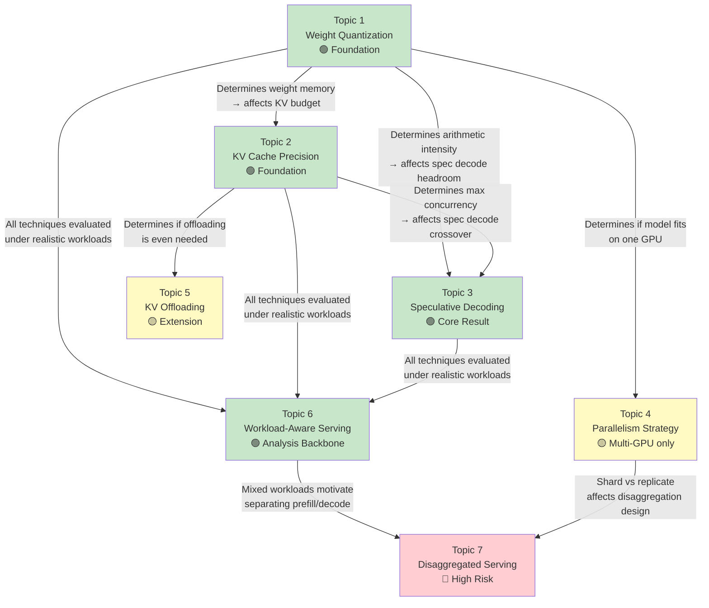

# Sub-Topic Selection Guide

## 1. Quick Compatibility Matrix

Before anything else — which topics are even feasible for you? Answer these hardware/access questions first:

| Question | If YES → unlocks | If NO → blocks |
|----------|-----------------|----------------|
| Do you have access to **a single GPU** (A100/H100)? | Topics 1, 2, 3, 5, 6 | Almost everything |
| Do you have access to **multiple GPUs** (2+ with NVLink)? | Topic 4 | Topic 4 is out |
| Do you have **CPU memory ≥ 128 GB** alongside the GPU? | Topic 5 (offloading) | Topic 5 is impractical |
| Can you run a **disaggregated serving setup** (separate prefill/decode pools)? | Topic 7 | Topic 7 is out |
| Do you have **≥ 4 weeks** of experiment time? | Any 3–4 topics | Stick to 2–3 topics |

---

## 2. Topic-by-Topic Analysis

### Topic 1 — Quantized-Weight Selection and Characterization

```
Alignment with your project:  ████████████████████ 100% (M1 core)
Hardware requirement:          Single GPU ✅
Implementation complexity:     Low — use pre-quantized checkpoints
Experiment time:               ~1 week
Standalone value:              High — produces a useful comparison table
```

**What you'd actually do:**
- Download Llama-3-8B in FP16, INT8, AWQ-INT4, GPTQ-INT4, FP8 formats
- Run each through SGLang/vLLM with identical workloads
- Measure: throughput, TTFT, TPOT, memory usage, MMLU, perplexity
- Find where INT4 quality breaks down (likely visible on reasoning-heavy tasks)

**Verdict:** 🟢 **Almost certainly pick this.** It's the foundation for everything else. Low risk, high value, and every other topic builds on knowing which weight format you're using.

---

### Topic 2 — KV-Cache Precision and the Concurrency Ceiling

```
Alignment with your project:  ████████████████████ 100% (M1 core)
Hardware requirement:          Single GPU ✅ (FP8 KV needs H100; INT8 works on A100)
Implementation complexity:     Low-Medium — toggle KV cache dtype in serving config
Experiment time:               ~1 week
Standalone value:              Medium — most interesting when combined with Topic 1
```

**What you'd actually do:**
- Fix weight quantization (from Topic 1's best choice)
- Sweep KV cache format: FP16 → FP8 → INT8
- At each format, measure the **maximum concurrent requests** before OOM
- Check if extra concurrency → real throughput gain or hits another bottleneck
- Vary context length (256 → 8192) to show when KV cache dominates memory

**Verdict:** 🟢 **Strong pick, especially paired with Topic 1.** Together they form a complete "memory optimization" study. The interesting finding is whether freed KV memory actually translates to throughput or just sits unused.

> [!TIP]
> **Topic 1 + Topic 2 together** form a natural "precision optimization" package. They share the same experimental setup and directly feed into each other. If you pick one, you should probably pick the other.

---

### Topic 3 — Speculative Decoding Across Load

```
Alignment with your project:  ████████████████████ 100% (M2 core)
Hardware requirement:          Single GPU ✅
Implementation complexity:     Medium — need to set up draft model/EAGLE-3
Experiment time:               ~1.5 weeks
Standalone value:              HIGH — the crossover finding is a strong result
```

**What you'd actually do:**
- Set up EAGLE-3 (or a small draft model like Llama-3-1B) with Llama-3-8B
- Sweep concurrency from 1 to 128
- Measure latency and throughput WITH vs WITHOUT speculation at each load
- Plot the crossover curve — find $C^*$ where speculation goes from helping to hurting
- Compare EAGLE-3 vs draft model vs n-gram speculation

**Verdict:** 🟢 **Highly recommended.** The crossover finding ("speculation helps below C=X but hurts above") is the single strongest result you can produce for this project. It directly answers the project's central question about regime-specific effectiveness.

> [!IMPORTANT]
> **This topic produces the project's "headline result."** The crossover curve is visually compelling, scientifically rigorous, and directly validates the project's thesis that techniques are not universally beneficial.

---

### Topic 4 — Parallelism Strategy — Shard vs Replicate

```
Alignment with your project:  ██████████████░░░░░░ 70% (M1, but multi-GPU specific)
Hardware requirement:          MULTIPLE GPUs (2-4+) with NVLink ⚠️
Implementation complexity:     Medium — configure TP/PP degrees in serving framework
Experiment time:               ~1.5 weeks
Standalone value:              Medium — well-studied area; findings less novel
```

**What you'd actually do:**
- Deploy Llama-3-8B with TP=1 (single GPU), TP=2, TP=4
- Compare against 2× replicas (each on single GPU)
- Measure latency (TP wins) vs throughput (replication may win)
- Profile inter-GPU communication overhead
- Show that after INT4 quantization, the model fits on one GPU → replication beats TP

**Verdict:** 🟡 **Pick only if you have multi-GPU access.** Without it, this topic is purely theoretical. Also, the finding ("replicate the INT4 model instead of sharding the FP16 model") is somewhat predictable. Less interesting as a standalone topic.

---

### Topic 5 — KV-Cache Offloading and Hierarchical Cache

```
Alignment with your project:  ██████░░░░░░░░░░░░░░ 30% (extension beyond original scope)
Hardware requirement:          Single GPU + large CPU memory ✅
Implementation complexity:     HIGH — KV offloading support varies across frameworks
Experiment time:               ~2 weeks
Standalone value:              Medium-High — novel angle, less explored
```

**What you'd actually do:**
- Enable KV cache offloading to CPU memory (vLLM supports this)
- Measure how many more concurrent requests or how much longer context you can handle
- Profile the PCIe transfer latency cost
- Find the regime where offloading beats just refusing requests
- Compare: offload to CPU vs offload to NVMe vs just serve fewer requests

**Verdict:** 🟡 **Interesting but risky.** This is the most "systems engineering" topic — lots of infrastructure complexity. It's outside your original project scope (M1/M2/M3 didn't mention offloading). Pick this only if you want to differentiate from standard approaches and have time for debugging.

---

### Topic 6 — Workload-Aware Serving

```
Alignment with your project:  ████████████████░░░░ 80% (M3 regime analysis)
Hardware requirement:          Single GPU ✅
Implementation complexity:     Medium — designing realistic workloads is the hard part
Experiment time:               ~1.5 weeks
Standalone value:              HIGH — directly enables M3's regime analysis
```

**What you'd actually do:**
- Design three workload types:
  - **Prefill-heavy**: long prompts (4K tokens), short outputs (64 tokens) — e.g., summarization
  - **Decode-heavy**: short prompts (128 tokens), long outputs (1K tokens) — e.g., story generation
  - **Mixed/Growing**: multi-turn agent with context growing over 5-10 turns
- Run the same "optimized" configuration on all three
- Show that the "optimal" config from a uniform benchmark degrades on mixed traffic
- Explore whether separating request types (priority queues) helps

**Verdict:** 🟢 **Excellent complementary pick.** This topic doesn't produce an optimization — it produces **the analysis that makes your other optimizations meaningful**. It's the backbone of M3. Pairs extremely well with Topics 1/2/3.

> [!TIP]
> **Topic 6 is the "glue" topic.** It doesn't add a new technique — it evaluates all your other techniques under realistic conditions. If you're picking 3-4 topics, this should be one of them.

---

### Topic 7 — Disaggregated Prefill and Decode

```
Alignment with your project:  ████████░░░░░░░░░░░░ 40% (extension beyond original scope)
Hardware requirement:          MULTIPLE GPUs + networking setup ⚠️
Implementation complexity:     VERY HIGH — need disaggregated serving framework
Experiment time:               ~2.5 weeks
Standalone value:              High — cutting-edge topic, very current research
```

**What you'd actually do:**
- Set up separate prefill and decode GPU pools (e.g., using Mooncake, DistServe, or Splitwise)
- Measure KV state transfer cost between pools
- Compare disaggregated vs colocated under different prompt lengths
- Find the "prefill length threshold" where disaggregation starts to help

**Verdict:** 🔴 **High risk, high reward.** This is the most complex topic by far. The infrastructure setup alone could take a week. The findings would be novel and impressive, but the risk of getting stuck is high. Pick only if you're confident in systems engineering and have multi-GPU access.

---

## 3. Dependency and Synergy Map



**Key dependencies to note:**
- Topic 2 **depends on** Topic 1 (you need to fix weight quantization before studying KV cache)
- Topic 3 **depends on** Topics 1+2 (spec decode's crossover point shifts based on quantization choices)
- Topic 6 **depends on** having at least 1-2 optimization topics to evaluate
- Topics 4, 5, 7 are **independent extensions** — interesting but not prerequisites for anything

---

## 4. Recommended Combinations

### 🏆 Combination A: "The Core Story" (Single GPU, Best Risk/Reward)

> **Topics 1 + 2 + 3 + 6**

```
Story: "We characterized how precision (weights + KV cache) and speculative
        decoding interact across load levels and workload shapes, revealing
        that the optimal configuration is regime-specific."
```

| Aspect | Assessment |
|--------|-----------|
| **Hardware needed** | Single A100/H100 |
| **Covers milestones** | M1 (Topics 1, 2) + M2 (Topic 3) + M3 (Topic 6) |
| **Risk** | Low — all techniques are well-supported in SGLang/vLLM |
| **Narrative strength** | Very strong — natural progression from memory → compute → analysis |
| **Timeline** | ~5 weeks |
| **Headline result** | "Speculative decoding gives 2.5× latency improvement at C=1 but causes 15% throughput loss at C=64, and this crossover shifts from C=48 to C=24 when weight quantization raises the batch size" |

> [!IMPORTANT]
> **This is my primary recommendation.** It directly maps to all three milestones, runs on a single GPU, and produces the strongest narrative — showing exactly how memory optimization (T1+T2) changes the effectiveness of compute optimization (T3), validated across realistic workloads (T6).

---

### Combination B: "Memory Deep Dive" (Single GPU, Focused)

> **Topics 1 + 2 + 5 + 6**

```
Story: "We explored the full memory hierarchy for LLM serving — from weight
        precision to KV cache precision to KV offloading — and mapped where
        each level of the hierarchy pays off."
```

| Aspect | Assessment |
|--------|-----------|
| **Hardware needed** | Single GPU + large CPU RAM |
| **Covers milestones** | M1 heavily; M3 via Topic 6 |
| **Risk** | Medium — KV offloading can be finicky |
| **Narrative strength** | Good — coherent "memory hierarchy" theme |
| **Missing** | No speculative decoding (M2 partially uncovered) |

---

### Combination C: "Full Systems" (Multi-GPU, Ambitious)

> **Topics 1 + 3 + 4 + 6**

```
Story: "We characterized how weight precision, speculative decoding, and
        parallelism strategy interact, showing that quantization changes
        whether you should shard or replicate, and that replication changes
        when speculation helps."
```

| Aspect | Assessment |
|--------|-----------|
| **Hardware needed** | 2–4 GPUs with NVLink |
| **Covers milestones** | M1 (Topics 1, 4) + M2 (Topic 3) + M3 (Topic 6) |
| **Risk** | Medium — parallelism experiments need multi-GPU |
| **Narrative strength** | Strong — three-way interaction story |
| **Missing** | KV cache quantization (Topic 2) |

---

## 5. Decision Checklist

Use this to finalize your selection:

```
STEP 1: Hardware Filter
  □ How many GPUs do I have?        → If 1: Topics 4, 7 are out
  □ Do I have large CPU RAM?        → If no: Topic 5 is impractical
  □ GPU type?                       → A100: no native FP8; H100: FP8 supported

STEP 2: Must-Haves (pick from these first)
  □ Topic 1 (Weight Quant)          → Almost always pick this (foundation)
  □ Topic 3 (Spec Decode)           → Strongest standalone result
  □ Topic 6 (Workload-Aware)        → Enables regime analysis (M3)

STEP 3: Pair Naturally
  □ If Topic 1 → strongly consider Topic 2 (natural pair)
  □ If Topic 3 → needs Topic 1 first (quantization affects crossover)
  □ If multi-GPU → Topic 4 becomes feasible and interesting
  □ If Topic 6 → needs at least 2 optimization topics to evaluate

STEP 4: Differentiation Check
  □ Does my combination tell a coherent story?
  □ Does it have at least one "headline result"?
  □ Does it cover M1, M2, AND M3 (at least partially)?
  □ Is every topic feasible with my hardware + timeline?

STEP 5: Confirm with mentor
  □ Present your combination with the "story" framing
  □ Ask if the scope is right (not too narrow, not too ambitious)
```

---

## 6. What I'd Recommend You Tell Your Mentor

> "I plan to select **Topics 1, 2, 3, and 6**. The story is: I characterize how precision choices for weights (Topic 1) and KV cache (Topic 2) change the system's memory and compute profile, then show how this shifted profile affects whether speculative decoding (Topic 3) helps or hurts at different load levels. Topic 6 validates everything under realistic mixed workloads. This covers all three milestones — M1 (precision optimization), M2 (speculative decoding), and M3 (regime analysis across workload shapes)."

If your mentor wants fewer topics, drop Topic 2 (KV cache quant) — it's the smallest standalone contribution. The core triangle of **Topics 1 + 3 + 6** is the strongest minimal set.

If your mentor wants more ambition and you have multi-GPU access, add **Topic 4** for a parallelism dimension.
