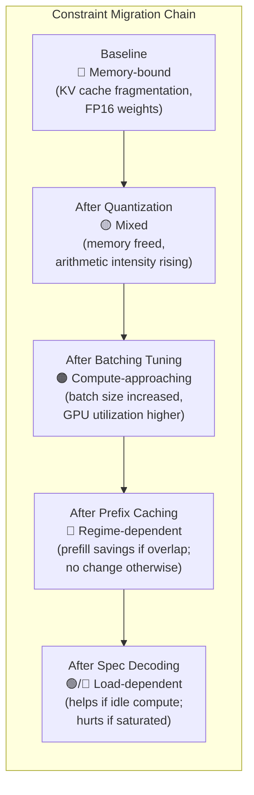
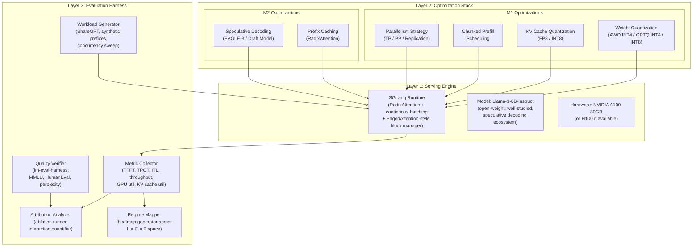
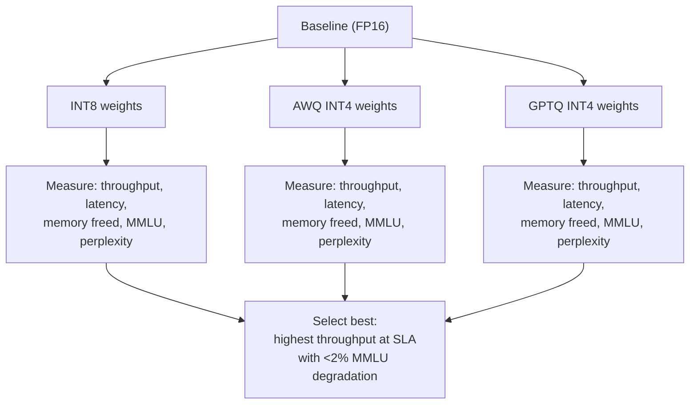
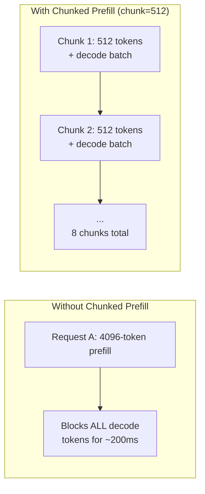
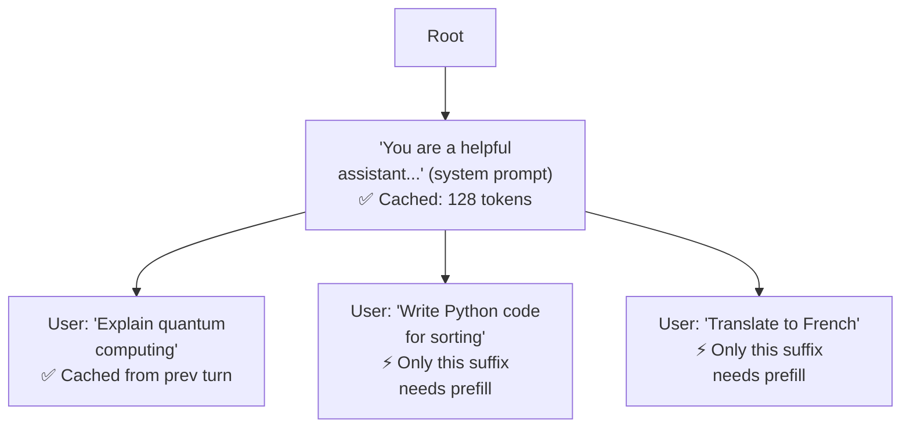
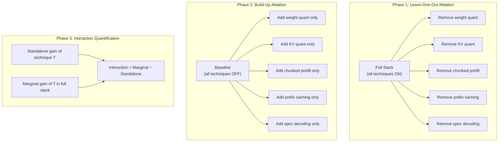
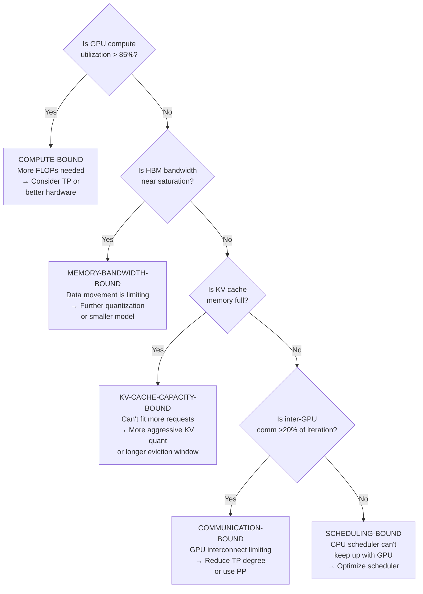
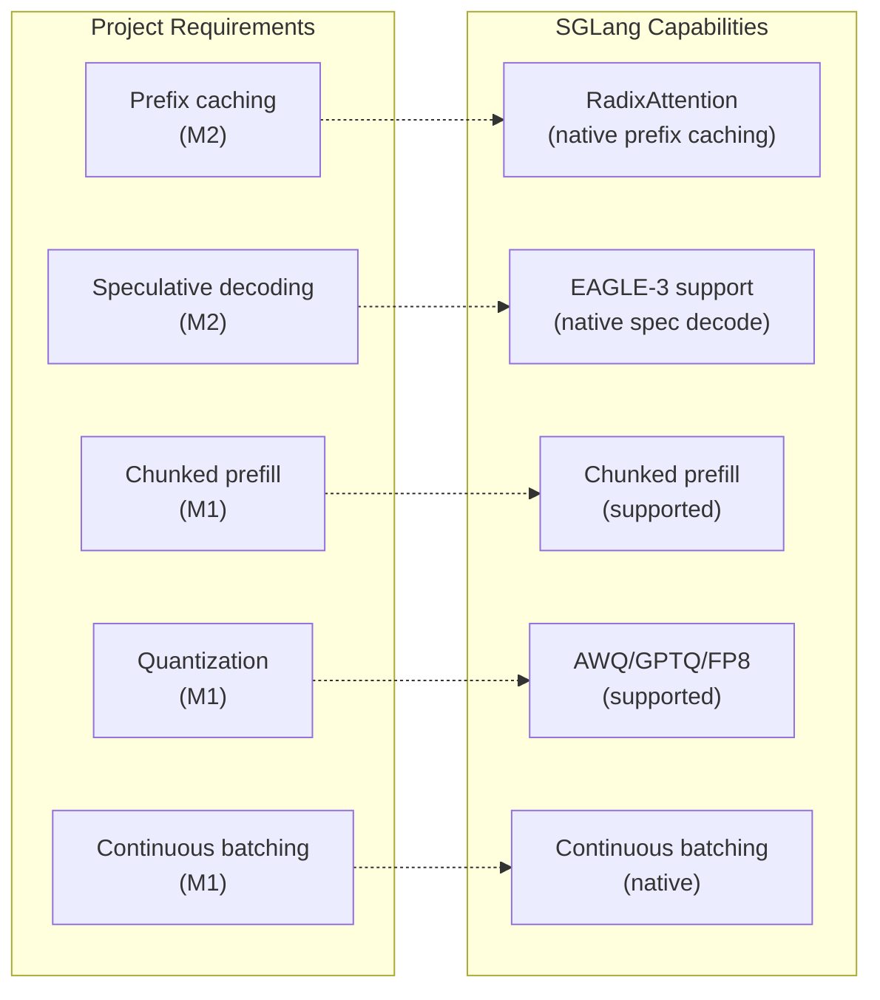
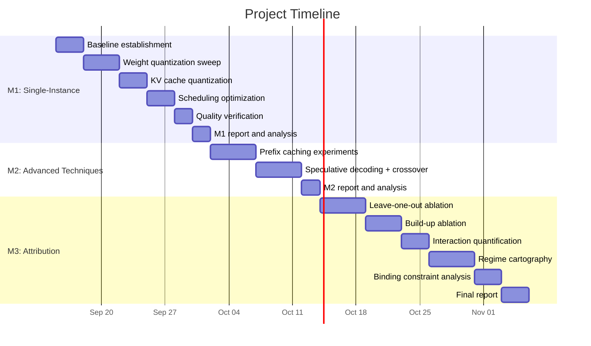

# System Design and Proposed Approach

## 1. Design Philosophy

### 1.1 The Core Principle: Constraint Migration

The central insight driving this design is that **each optimization shifts the system's binding constraint**, which changes the effectiveness of every subsequent optimization. Therefore, the approach must be:

1. **Staged** — apply optimizations in a deliberate order, measuring the binding constraint after each stage
2. **Ablation-aware** — every combination must be measured, not just individual techniques
3. **Regime-parameterized** — every experiment must be repeated across the full operating-regime space



### 1.2 Why This Order Matters

Optimizations are applied in order of **decreasing universality** and **increasing workload-dependence**:

| Stage | Technique | Universality | Workload Dependence |
|-------|-----------|-------------|-------------------|
| 1 | Weight quantization | Universal — always reduces memory | Low — affects all workloads similarly |
| 2 | KV cache quantization | Near-universal — always saves memory | Low-moderate — more impactful for long contexts |
| 3 | Scheduling (chunked prefill) | Broadly beneficial | Moderate — larger gains with pipeline parallelism |
| 4 | Parallelism strategy | Hardware-dependent | Moderate — depends on GPU count and interconnect |
| 5 | Prefix caching | Workload-dependent | **High** — requires prefix overlap |
| 6 | Speculative decoding | Load-dependent | **High** — requires idle compute |

By applying universal techniques first, we establish a strong optimized baseline before introducing workload-dependent techniques whose effectiveness depends on the state created by the earlier stages.

---

## 2. System Architecture

The system consists of three layers: the **Serving Engine** (the deployment substrate), the **Optimization Stack** (the techniques applied to the engine), and the **Evaluation Harness** (the measurement and analysis framework).



### 2.1 Technology Choices and Rationale

| Component | Choice | Rationale |
|-----------|--------|-----------|
| **Serving engine** | **SGLang** | Native RadixAttention (needed for M2 prefix caching); supports chunked prefill, continuous batching, TP, speculative decoding; competitive with vLLM on throughput; avoids needing to integrate prefix caching into vLLM separately |
| **Model** | **Llama-3-8B-Instruct** | Open-weight; widely benchmarked (easy quality comparison); fits on a single A100 at FP16 (~16 GB weights); large enough for KV cache to matter; well-supported quantization (AWQ, GPTQ); EAGLE-3 speculator heads available |
| **Weight quantization** | **AWQ (INT4)** as primary; **GPTQ (INT4)** and **INT8** as comparison points | AWQ provides best accuracy-at-4-bit; GPTQ gives broader compatibility; INT8 serves as a quality-conservative option |
| **KV cache quantization** | **FP8 (E4M3)** on H100; **INT8** on A100 | FP8 is native on Hopper; INT8 is universally supported; both provide ~50% KV cache memory reduction |
| **Draft model / speculator** | **EAGLE-3 speculator head** | Higher acceptance rate (0.72–0.78) than standalone draft models; reuses target model features; minimal additional memory overhead vs. separate draft model |
| **Quality evaluation** | **lm-eval-harness** (EleutherAI) | Industry standard; automated; supports MMLU, HumanEval, perplexity on WikiText-2; directly integrates with vLLM/SGLang backends |
| **Benchmarking tool** | **SGLang benchmark suite** + custom scripts | Native integration; supports request-rate sweeps, concurrency control, ShareGPT dataset |
| **Workload dataset** | **ShareGPT** (natural distribution) + **synthetic workloads** (controlled prefix overlap, context length) | ShareGPT provides realistic length distributions; synthetic workloads allow controlled regime exploration |

---

## 3. Detailed Approach: M1 — Optimized Single-Instance Serving

### 3.1 Phase 1: Baseline Establishment

Deploy Llama-3-8B-Instruct at FP16 with default SGLang settings (no quantization, no prefix caching, no speculative decoding, default batch size, single GPU).

**Measurements at baseline:**

```
For each concurrency level C ∈ {1, 2, 4, 8, 16, 32, 64}:
    Run 1000 requests from ShareGPT dataset at request rate = C/2 req/s
    Record:
        - TTFT (p50, p95, p99)
        - TPOT (p50, p95, p99)
        - End-to-end latency (p50, p95, p99)
        - Throughput (output tokens/sec)
        - GPU compute utilization (%)
        - GPU memory utilization (%)
        - KV cache utilization (%)
    Also record:
        - Quality: MMLU (5-shot), perplexity on WikiText-2
```

**Establish the latency target:** From the baseline curve, identify the p99 latency at moderate concurrency (e.g., C=16) — this becomes the **SLA target** that all optimized configurations must meet.

### 3.2 Phase 2: Weight Quantization

Apply weight quantization and measure the effect on both performance and quality.



**What we expect to observe:**
- INT4 (AWQ) frees ~75% of weight memory (16 GB → ~4 GB), enabling significantly more KV cache capacity
- Throughput increases because (a) more memory for concurrent requests, and (b) each decode step moves fewer bytes → effective bandwidth increase
- Quality: <1% MMLU drop for AWQ INT4 on Llama-3-8B (based on published results)

**Key metric:** Memory freed → theoretical maximum concurrent requests → achievable batch size increase

### 3.3 Phase 3: KV Cache Quantization

On top of the selected weight quantization, apply KV cache compression.

**Configurations tested:**
| Config | Weights | KV Cache | Total Memory Savings |
|--------|---------|----------|---------------------|
| A | AWQ INT4 | FP16 (baseline KV) | ~75% weight savings only |
| B | AWQ INT4 | FP8 | ~75% weight + ~50% KV savings |
| C | AWQ INT4 | INT8 | ~75% weight + ~50% KV savings |

**What we expect to observe:**
- At **short contexts** (256–512 tokens): KV cache is a small fraction of total memory → KV quantization has minimal impact
- At **long contexts** (4K–8K tokens): KV cache dominates memory → FP8/INT8 KV cache dramatically increases achievable concurrency
- Quality impact: FP8 is nearly lossless; INT8 may show minor degradation at very long contexts due to accumulated attention errors

### 3.4 Phase 4: Scheduling Optimization (Chunked Prefill)

Enable chunked prefill and tune the chunk size.

**Experiment:** Sweep chunk size ∈ {128, 256, 512, 1024, 2048} tokens at concurrency C=16 with mixed prompt lengths (from ShareGPT).



**What we expect to observe:**
- Without chunked prefill: long prompts cause **decode stalls** — p99 ITL spikes when new long-prompt requests arrive
- With chunked prefill: ITL variance decreases dramatically; p99 latency drops
- **Optimal chunk size** balances: too large → re-introduces stalls; too small → scheduling overhead and underutilized compute per iteration

### 3.5 Phase 5: Parallelism Strategy (If Multi-GPU)

If multiple GPUs are available, compare TP vs PP vs replication.

| Strategy | Configuration | When It Wins |
|----------|--------------|-------------|
| **TP=2** | Model split across 2 GPUs per layer | After quantization, if the model is becoming compute-bound (higher batch sizes); latency-sensitive |
| **PP=2** | First half of layers on GPU 0, second half on GPU 1 | If memory is still the constraint; throughput-priority; chunked prefill helps reduce pipeline bubbles |
| **Replication** | Full model on each GPU, load-balanced | If the model fits on one GPU (after INT4 quantization, Llama-3-8B is ~4 GB); maximum simplicity; throughput = 2× |

**Decision logic:**
```
If model fits on single GPU after quantization:
    → Replication (simplest, linear throughput scaling)
    → Unless latency must be halved → TP=2
If model doesn't fit on single GPU:
    → TP (if latency-priority) or PP (if throughput-priority)
```

For Llama-3-8B at AWQ INT4 (~4 GB weights), the model fits easily on one A100 (80 GB), leaving ~76 GB for KV cache. **Replication is likely optimal** for throughput, with TP=2 reserved for latency-critical deployments.

### 3.6 M1 Deliverable

A configuration table showing the **best M1 configuration** and the improvement over baseline:

```
Example M1 result:
┌─────────────────────────┬───────────┬──────────────┬─────────────┐
│ Configuration           │ Throughput│ p99 Latency  │ MMLU (5-shot)│
├─────────────────────────┼───────────┼──────────────┼─────────────┤
│ Baseline (FP16, default)│ 850 tok/s │ 1200 ms      │ 65.2%       │
│ + AWQ INT4 weights      │ 1400 tok/s│  780 ms      │ 64.8%       │
│ + FP8 KV cache          │ 1650 tok/s│  720 ms      │ 64.7%       │
│ + Chunked prefill (512) │ 1700 tok/s│  550 ms      │ 64.7%       │
│ M1 Best                 │ 2.0× ↑   │ 2.2× ↓       │ -0.5% (ok)  │
└─────────────────────────┴───────────┴──────────────┴─────────────┘
```

---

## 4. Detailed Approach: M2 — Context Reuse and Multi-Token Generation

### 4.1 Prefix Caching (RadixAttention)

#### 4.1.1 Mechanism

SGLang's RadixAttention maintains a **radix tree** over the KV cache. Each path from root to leaf represents a token sequence whose KV states are cached.



When a new request arrives with a prompt that shares a prefix with a cached entry, the system:
1. Performs **longest prefix match** in the radix tree
2. Loads the cached KV states for the matched prefix (zero compute cost)
3. Only computes prefill for the **unmatched suffix**

#### 4.1.2 Experimental Protocol

To isolate the effect of prefix caching, we construct **synthetic workloads with controlled prefix overlap**:

| Workload | Description | Prefix Overlap |
|----------|-------------|---------------|
| **W0** | Unique prompts (no shared prefix) | 0% |
| **W25** | 25% of prompt tokens shared across all requests | 25% |
| **W50** | 50% shared (e.g., 512-token system prompt + 512 unique) | 50% |
| **W75** | 75% shared (long system prompt + short unique query) | 75% |
| **W90** | 90% shared (multi-turn chat with long history) | 90% |

For each workload, measure:
- **TTFT** — should decrease as prefix overlap increases (less prefill compute)
- **Throughput** — should increase (prefill compute saved, memory shared)
- **Cache hit rate** — should correlate with overlap ratio
- **Cache memory usage** — shared entries should reduce total KV cache memory

**Expected result shape:**

```
TTFT Reduction (%) vs. Prefix Overlap (%)

100% ┤
     │                                    ●  (W90: ~85% TTFT reduction)
 80% ┤                              ●
     │                        ●
 60% ┤                  
     │            ●
 40% ┤
     │      ●
 20% ┤
     │ ●
  0% ┤──────────────────────────────────────
     0%    25%    50%    75%    90%   100%
                Prefix Overlap
```

#### 4.1.3 When It Doesn't Help

Prefix caching adds overhead (radix tree lookups, cache management, LRU eviction). For workload W0 (zero overlap), we expect:
- **Zero TTFT improvement** (no prefix match → full prefill computed)
- **Possible slight degradation** from radix tree management overhead
- This is a valid negative result for M3's regime analysis

### 4.2 Speculative Decoding

#### 4.2.1 Mechanism

Using EAGLE-3 as the speculator head:

```mermaid
sequenceDiagram
    participant D as EAGLE-3 Speculator
    participant T as Llama-3-8B (Target)
    
    Note over D,T: Decode step (generating tokens)
    
    D->>D: Draft K=5 candidate tokens\n(uses target model's hidden states;\nvery lightweight)
    D->>T: Send 5 draft tokens for verification
    T->>T: Single forward pass:\nverify all 5 tokens in parallel
    T->>T: Accept first 3 (match distribution),\nreject token 4, sample correction
    Note over T: Result: 4 tokens generated\nin ~1 forward pass\n(instead of 4 separate passes)
```

#### 4.2.2 The Crossover Experiment (Key M2 Deliverable)

This is the most important experiment in M2: **at what concurrency does speculative decoding stop being beneficial?**

**Protocol:**
```
For each concurrency C ∈ {1, 2, 4, 8, 16, 32, 48, 64, 96, 128}:
    Run two configurations:
        Config A: M1-optimized (AWQ INT4 + FP8 KV + chunked prefill) WITHOUT spec decode
        Config B: M1-optimized + EAGLE-3 speculative decoding (K=5)
    
    Measure:
        - Latency (TPOT) for both configs
        - Throughput for both configs
        - Acceptance rate (Config B only)
        - GPU compute utilization for both configs
    
    Compute:
        - Δ_latency(C) = latency_B(C) - latency_A(C)
        - Δ_throughput(C) = throughput_B(C) - throughput_A(C)
    
    The crossover point C* is where Δ_latency crosses zero
    (i.e., speculative decoding transitions from helping to hurting)
```

**Expected result:**

```
Latency Improvement (%) from Speculative Decoding vs. Concurrency

 60% ┤ ●
     │   ●
 40% ┤     ●
     │       ●
 20% ┤         ●
     │           ●
  0% ┤─────────────●──C*───────────────────── Crossover
     │               ●
-20% ┤                 ●
     │                   ●
-40% ┤                     ●
     └────────────────────────────────────
     1   2   4   8  16  32  48  64  96  128
                 Concurrency (C)
```

#### 4.2.3 Why the Crossover Happens (Systems Explanation)

| Regime | GPU State | Speculative Decoding Effect |
|--------|-----------|---------------------------|
| **Low C (1–8)** | Decode is deeply memory-bound; GPU compute is ~5–15% utilized; massive idle capacity | EAGLE-3 uses idle compute "for free"; K tokens verified in 1 pass instead of K passes; **large latency win** |
| **Medium C (16–32)** | Batching raises arithmetic intensity; GPU compute reaching ~40–60%; idle capacity shrinking | EAGLE-3 overhead starts competing with batch computation; gains diminish; acceptance rate may drop if batch introduces contention |
| **High C (64+)** | Batch size saturates compute; GPU at ~80%+ utilization; approaching compute-bound regime | EAGLE-3's draft+verify passes **add work** to an already-saturated pipeline; memory for draft KV cache reduces space for real requests; **net slowdown** |

### 4.3 M2 Deliverable

1. **Prefix caching effectiveness curve**: TTFT reduction as a function of prefix overlap ratio
2. **Speculative decoding crossover point**: the concurrency $C^*$ at which speculative decoding transitions from beneficial to harmful
3. **Conditions statement**: "Prefix caching provides ≥X% TTFT reduction when overlap > Y%. Speculative decoding reduces TPOT by Z% at concurrency < $C^*$ but increases TPOT by W% at concurrency > $C^*$."

---

## 5. Detailed Approach: M3 — Attribution and Operating-Regime Analysis

### 5.1 The Attribution Framework

M3 requires disentangling the contributions of techniques that interact. This is done through a **three-phase attribution analysis**:



#### Phase 1: Leave-One-Out (Marginal Contribution)

For each technique $T_i$, measure performance of the **full stack minus $T_i$**:

$$\text{Marginal}(T_i) = \text{Perf}(\text{Full Stack}) - \text{Perf}(\text{Full Stack} \setminus T_i)$$

This tells us: "How much does removing $T_i$ hurt, given that all other techniques are active?"

#### Phase 2: Build-Up (Standalone Contribution)

For each technique $T_i$, measure performance of **baseline plus $T_i$ only**:

$$\text{Standalone}(T_i) = \text{Perf}(\text{Baseline} + T_i) - \text{Perf}(\text{Baseline})$$

This tells us: "How much does $T_i$ help when applied alone?"

#### Phase 3: Interaction Quantification

The **interaction effect** of technique $T_i$ is:

$$\text{Interaction}(T_i) = \text{Marginal}(T_i) - \text{Standalone}(T_i)$$

- **Interaction > 0** → $T_i$ is **more valuable** in the presence of other techniques (synergy)
- **Interaction < 0** → $T_i$ is **less valuable** or redundant when others are present (competition)
- **Interaction ≈ 0** → $T_i$'s effect is independent of other techniques

**Example expected results:**

| Technique | Standalone Gain | Marginal (in Full Stack) | Interaction | Explanation |
|-----------|----------------|--------------------------|-------------|-------------|
| Weight Quant (INT4) | +65% throughput | +70% throughput | **+5% (synergy)** | Frees memory that other techniques (prefix caching, higher batch) exploit |
| KV Cache Quant (FP8) | +15% throughput | +20% throughput | **+5% (synergy)** | Enables longer contexts which make prefix caching more valuable |
| Chunked Prefill | +10% throughput | +8% throughput | **−2% (slight competition)** | Prefix caching already reduces prefill load, so chunked prefill has less to improve |
| Prefix Caching | +40% throughput (W75) | +35% throughput | **−5% (mild competition)** | KV cache quant already freed memory, reducing the memory-saving value of shared caching |
| Spec Decoding | +30% latency (C=4) | +15% latency | **−15% (competition)** | Quantization enabled higher batch sizes → less idle compute → less room for speculation |

### 5.2 Binding Constraint Identification

After applying the full optimization stack, determine **what limits performance now**:



**Method:** Use GPU profiling tools (NVIDIA Nsight Systems, `torch.profiler`) to measure:
- Time spent in compute kernels vs. memory transfer vs. communication vs. idle
- Per-iteration breakdown: attention compute, FFN compute, KV cache read, all-reduce (if TP)

### 5.3 Operating-Regime Cartography

The final deliverable is a **three-dimensional regime map** across:

| Dimension | Values | Variable |
|-----------|--------|----------|
| **Context length ($L$)** | 256, 1024, 4096, 8192 | Controls KV cache size and prefill cost |
| **Concurrency ($C$)** | 1, 4, 16, 32, 64 | Controls batch size and compute utilization |
| **Prefix overlap ($P$)** | 0%, 50%, 90% | Controls prefix caching effectiveness |

This produces **4 × 5 × 3 = 60 cells**, each requiring measurement of the full stack plus ablations. For each cell, we determine:

1. **Best configuration** (which techniques should be ON/OFF)
2. **Binding constraint** (what limits performance in this cell)
3. **Dominant technique** (which technique contributes the most in this cell)

**Example regime map (one slice at prefix overlap = 50%):**

```
Recommended Configuration: Context Length × Concurrency (P=50%)

                    Context Length
                256      1024     4096     8192
           ┌─────────┬─────────┬─────────┬─────────┐
    C=1    │ Q+SD    │ Q+SD    │ Q+KQ+SD │ Q+KQ+SD │  ← Low load:
           │ compute │ compute │ memory  │ memory  │    spec decode helps
           ├─────────┼─────────┼─────────┼─────────┤
    C=4    │ Q+SD    │ Q+PC+SD│ Q+KQ+   │ Q+KQ+   │
           │ compute │ compute │ PC+SD   │ PC+SD   │
           ├─────────┼─────────┼─────────┼─────────┤
    C=16   │ Q+CP    │ Q+PC+CP│ Q+KQ+   │ Q+KQ+   │  ← Medium load:
           │ compute │ mixed   │ PC+CP   │ PC+CP   │    SD fading
           ├─────────┼─────────┼─────────┼─────────┤
    C=32   │ Q+CP    │ Q+PC+CP│ Q+KQ+   │ Q+KQ+   │
           │ compute │ compute │ PC+CP   │ PC+CP   │
           ├─────────┼─────────┼─────────┼─────────┤
    C=64   │ Q+CP    │ Q+CP   │ Q+KQ+CP│ Q+KQ+   │  ← High load:
           │ compute │ compute │ KV-cap  │ PC+CP   │    NO spec decode
           └─────────┴─────────┴─────────┴─────────┘

Legend: Q=Quantization, KQ=KV Quant, CP=Chunked Prefill,
        PC=Prefix Caching, SD=Speculative Decoding
        Bottom row = binding constraint
```

### 5.4 M3 Deliverables

1. **Attribution table** with standalone, marginal, and interaction effects for each technique
2. **Binding constraint identification** for the final optimized configuration (with profiling evidence)
3. **60-cell regime map** showing optimal configuration per operating point
4. **Negative results** with systems-level explanations (e.g., "Speculative decoding is harmful at $C > C^*$ because...")
5. **Key insight synthesis**: which 2–3 findings are the most important for practitioners

---

## 6. Why This Approach Effectively Addresses the Problem

### 6.1 Mapping Design Decisions to Challenges

| Problem Challenge | How the Approach Addresses It |
|-------------------|-------------------------------|
| **Non-composability** | The three-phase attribution framework (leave-one-out + build-up + interaction quantification) explicitly measures interaction effects, revealing synergies and competitions that would be invisible with independent evaluation |
| **Regime-specificity** | The 60-cell regime cartography systematically varies the three key dimensions (context length, concurrency, prefix overlap), ensuring that every technique is evaluated across its effective and ineffective regimes |
| **Constraint migration** | The staged optimization pipeline (universal → workload-dependent) with binding-constraint identification after each stage tracks exactly how the bottleneck shifts as techniques are applied |
| **Quality preservation** | Quality is verified at every quantization step using lm-eval-harness (MMLU, perplexity), with a hard gate: configurations exceeding 2% MMLU degradation are rejected |
| **Speculative decoding crossover** | The dedicated crossover experiment sweeps concurrency from 1 to 128, directly measuring the point where speculation transitions from beneficial to harmful |

### 6.2 Why SGLang Is the Right Substrate



SGLang is the only framework that natively supports **all five techniques** needed for this project within a single, coherent runtime. Using vLLM would require separate integration of RadixAttention-quality prefix caching. Using TensorRT-LLM would add compilation overhead and limit hardware flexibility.

### 6.3 Why Llama-3-8B Is the Right Model

| Criterion | Llama-3-8B Fit |
|-----------|---------------|
| **Open-weight** | ✅ Fully open (Meta license) |
| **Fits on single GPU at FP16** | ✅ ~16 GB weights on 80 GB A100 (leaves 64 GB for KV cache) |
| **Quantization ecosystem** | ✅ AWQ, GPTQ, FP8 all well-tested |
| **Speculative decoding ecosystem** | ✅ EAGLE-3 speculator heads available |
| **Quality benchmarks available** | ✅ Extensively benchmarked on MMLU, HumanEval, etc. |
| **Large enough for KV cache to matter** | ✅ 8B parameters with GQA → KV cache is significant at long contexts |
| **Small enough for single-GPU experiments** | ✅ Enables rapid iteration without multi-GPU complexity |

---

## 7. Experimental Protocol Summary

### 7.1 Experiment Matrix

| Phase | Experiments | Configurations | Total Runs |
|-------|------------|----------------|------------|
| **M1: Baseline** | 1 (baseline at 7 concurrency levels) | 1 × 7 = 7 | 7 |
| **M1: Weight Quant** | 3 methods × 7 concurrency levels | 21 | 21 |
| **M1: KV Quant** | 2 methods × 4 context lengths × 4 concurrency levels | 32 | 32 |
| **M1: Scheduling** | 5 chunk sizes × 4 concurrency levels | 20 | 20 |
| **M2: Prefix Caching** | 5 overlap levels × 4 context lengths × 4 concurrency levels | 80 | 80 |
| **M2: Spec Decode Crossover** | 10 concurrency levels × 2 configs (with/without SD) | 20 | 20 |
| **M3: Leave-One-Out** | 5 techniques removed × 60 regime cells (subset) | ~100 | ~100 |
| **M3: Build-Up** | 5 techniques added × key regime cells | ~50 | ~50 |
| **Quality Verification** | Each quantization config × 3 benchmarks | ~12 | 12 |
| | | **Estimated total** | **~340** |

### 7.2 Statistical Rigor

For each configuration:
- **3 independent runs** with different random seeds for request ordering
- Report **mean ± standard deviation** for all metrics
- Use **Welch's t-test** (p < 0.05) to determine if differences between configurations are statistically significant
- **Warm-up phase**: 100 requests discarded before measurement begins
- **Steady-state requirement**: measurement period must be ≥5 minutes at target request rate

### 7.3 Timeline


